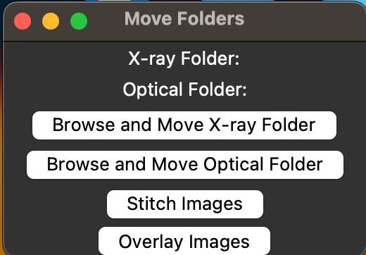
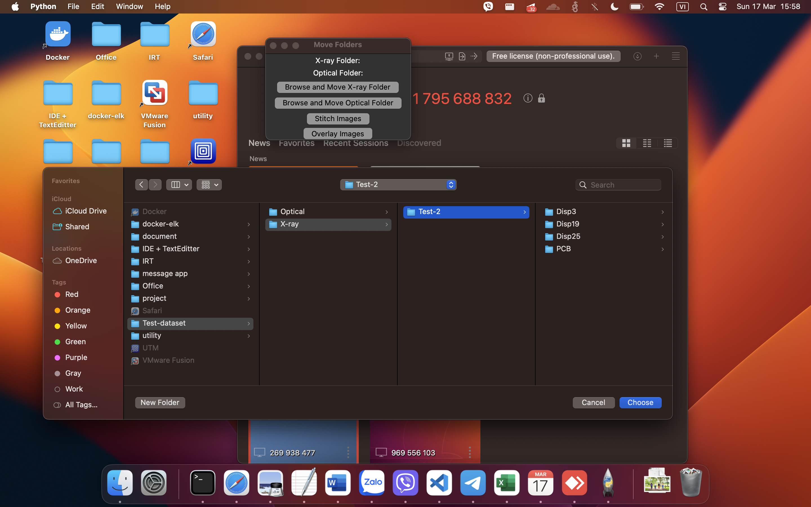
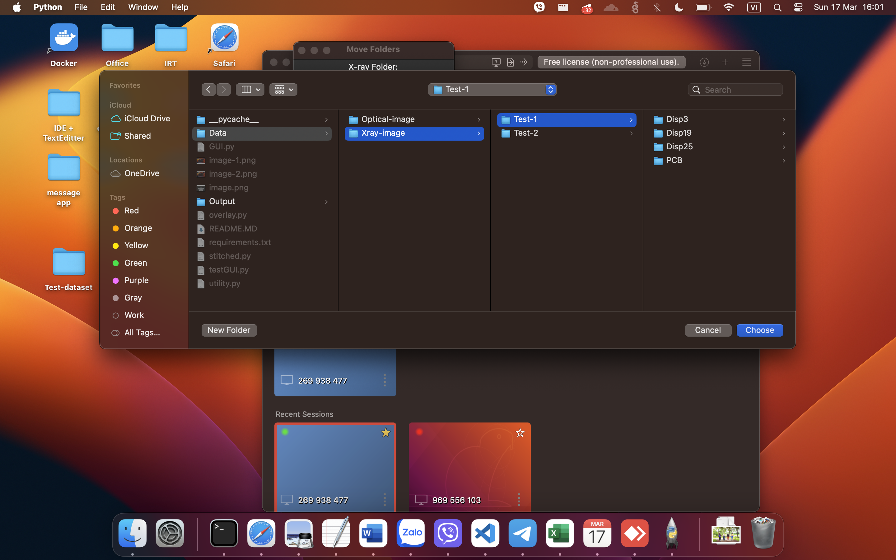
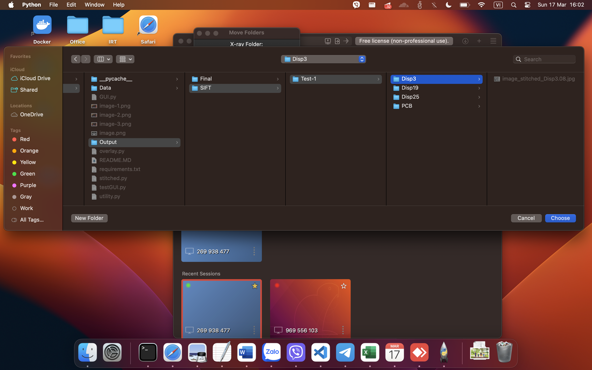
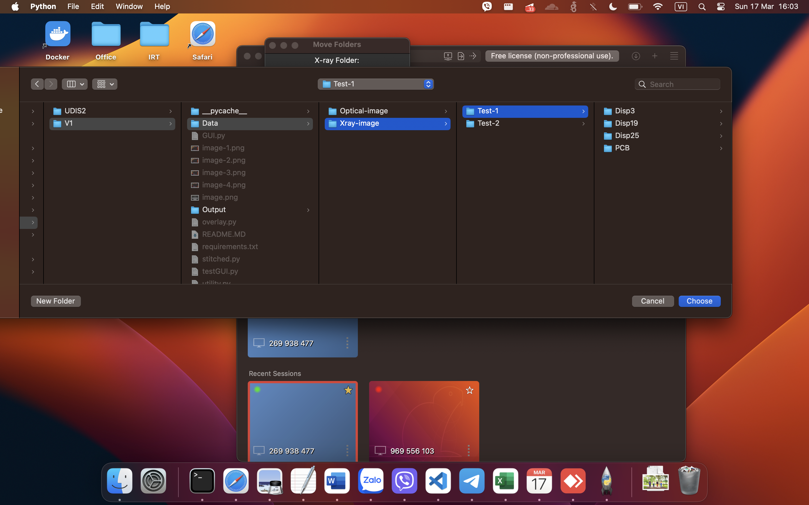
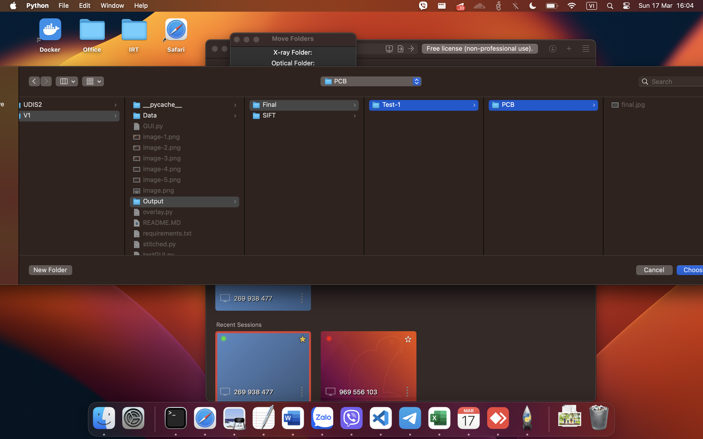

# Image stitching and synchronizing tools

## Installation

Download repository

```bash
git clone https://github.com/phuong0111/Image-stitching.git
cd Image-stitching
```

Set up environment and install requirements

```bash
pip install virtualenv
python -m venv env
source env/bin/activate 
pip install -r requirements.txt
```

## Usage

Folder structure
```
└── Image-stitching/
    ├── Data/
    │   ├── Optical-image/
    │   │   └── Dataset-1/
    │   │       └── Folder-1/
    │   │           ├── 1.jpg
    │   │           ├── 2.jpg       # each image is a part of board 
    │   │           └── ...
    │   └── Xray-image/
    │       └── Dataset-1/
    │           └── Folder-1/
    │               └── 1.jpg       # each folder contains only one optical image
    ├── Output/
    │   ├── Final/
    │   │   └── Dataset-1/
    │   │       └── Folder-1/
    │   │           └── final.jpg   # result after synchronizing
    │   └── SIFT/
    │       └── Dataset-1/
    │           └── Folder-1/
    │               └── image-stitched.jpg      # result after stitching
    ├── overlay.py
    ├── stitched.py
    └── utility.py
```

Stitching X-ray image:

```bash
python3.11 stitched.py -d <Dataset name>
```

Synchronizing stitched X-ray image and optical image:

```bash
python3.11 overlay.py -d <Dataset name> [-a] <optical image transparency, default 0.2> [-b] <xray image transparency, default 0.8>
```

GUI

```
python3.11 GUI.py
```



Add dataset



Stitch image



Output in 



Overlay image



Output in 


